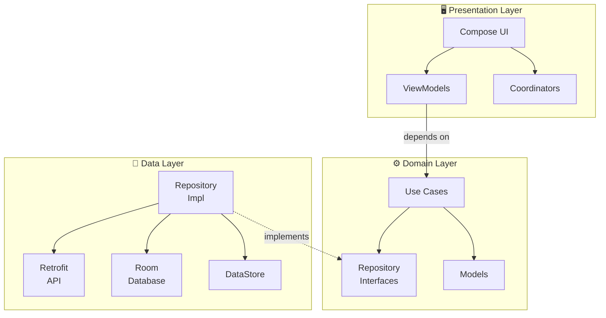

# 🍳 CoolRecipes

A recipe search and discovery Android app built to search for recipes by name or ingredient, view detailed recipe information, and save favorites for offline access.

> **API:** [Spoonacular](https://spoonacular.com/food-api) · **Min SDK:** 30 · **Target SDK:** 36 · **Kotlin:** 2.2 · **Compose**

---

## Table of Contents

- [Setup & Configuration](#setup--configuration)
- [Architecture Overview](#architecture-overview)
- [Module Structure](#module-structure)
- [Key Design Decisions](#key-design-decisions)
- [Features](#features)
- [Tech Stack](#tech-stack)
- [Testing](#testing)

---

## Setup & Configuration

### Prerequisites

- **Android Studio** Meerkat (2024.3+) or later
- **JDK 17** (configured in `gradle.properties`)
- A free [Spoonacular API key](https://spoonacular.com/food-api/console#Profile)

### Add your API key

The project reads the Spoonacular API key from `local.properties` (which is git-ignored and never committed to version control).

Open (or create) the `local.properties` file **in the project root** and add:

```properties
RECIPES_API_KEY=your_spoonacular_api_key_here
```

---

## Architecture Overview

The project follows **Clean Architecture** with the **MVVM** pattern in the Presentation layer and the **Repository Pattern** in the Data layer.



**Dependency rule:** Dependencies point **inward** — the Domain layer has zero Android framework dependencies (only `javax.inject` for DI annotations). The Data layer implements Domain interfaces, and the Presentation layer consumes Domain use cases.

---

## Key Design Decisions

### Navigation: Jetpack Navigation 3 + Coordinator Pattern

The app uses **Jetpack Navigation 3** (typed routes with `NavDisplay`) combined with a custom **Coordinator pattern**. Each feature section (Recipes, Favorites, Settings) has its own Coordinator composable that encapsulates navigation logic, keeping individual screens unaware of the navigation graph.

The `RootCoordinator` orchestrates the top-level navigation with a bottom navigation bar across three tabs.

### Dependency Injection: Hilt

All dependencies are provided via **Hilt** with `@Singleton`-scoped modules. The DI graph is split across dedicated modules:

- `DatabaseModule` — Room database instance
- `DaoModule` — DAO providers
- `NetworkModule` — Retrofit, OkHttp, serialization
- `RepositoryModule` — Repository interface bindings

### State Management: StateFlow + Immutable ViewStates

ViewModels expose their state via `StateFlow<ViewState>`. View states are `@Immutable` data classes, and handler functions are exposed as public methods on the ViewModel. Compose screens collect state and call ViewModel methods directly — no lambdas stored in state objects.

### Pagination: Generic IndexPaginator

Pagination is handled by a **reusable `IndexPaginator<T>` interface** defined in the Domain layer, with a thread-safe `OffsetPaginator<T>` implementation in the Data layer. This approach:

- Decouples pagination logic from the repository
- Makes pagination independently testable
- Can be reused for any index-based paginated entity in the future

The paginator uses a `Mutex` for thread safety and exposes paginated data via `StateFlow<PaginatedData<T>>`.

### Offline Support: Room Database

Previously viewed recipes are cached in a **Room database** with three tables:

- **Recipes** — cached recipe list items
- **RecipeDetails** — full recipe information
- **FavoriteRecipes** — user-favorited recipes with metadata (title, image, summary)

The `RecipeDetailsScreen` first attempts to load from the local cache (instant display), then refreshes from the API in the background. Favorites are fully persisted and available offline via reactive `Flow` queries.

### Networking: Retrofit + ApiCaller Abstraction

API calls go through a custom `ApiCaller` abstraction that provides:

- **Connectivity checking** before making network requests
- **Typed error handling** via a sealed `ApiResult<T>` class (`Success`, `Failure`)
- **Granular error types** — `NoInternet`, `HTTPError`, `EmptyBody`, `Unknown`
- **IO dispatcher** switching for all network calls

The Spoonacular API key is injected via `BuildConfig` and added to requests through an OkHttp interceptor.

### Theming: Custom Design System + Dark/Light Mode

The app includes a dedicated `designsystem` module with a custom `CoolRecipesTheme` that provides:

- Custom color palette (light and dark variants)
- Custom typography scale
- Custom spacing tokens

The theme responds to **system preferences** by default and offers an **in-app toggle** on the Settings screen (persisted via DataStore).

### Error Handling

Errors are handled gracefully at every layer:

- **Data layer:** `ApiCaller` catches exceptions and returns typed `ApiResult.Failure`
- **Repository:** Maps API/DB errors to domain-level sealed result types
- **ViewModel:** Maps results to UI-friendly error states with retry actions
- **UI:** Dedicated `MessageView` displays contextual error messages with a retry button

---

## Features

- 🔍 Search recipes by name or ingredient
- 📋 Scrollable recipe cards with image, title, and summary
- 📖 Recipe detail screen (ingredients, instructions, source link)
- 🔄 Sort recipes (popularity, health score, time, etc.)
- ⭐ Favorite recipes with offline access
- 💾 Local caching of viewed recipes (offline support)
- 🌗 Dark/Light mode (system + in-app toggle)
- 📄 Pagination with infinite scroll
- ⚠️ Graceful error handling with retry
- 🧪 Automated tests (Domain + Data + ViewModel)

---

## Tech Stack

| Category | Technology |
|---|---|
| **Language** | Kotlin 2.2 |
| **UI** | Jetpack Compose (BOM 2025.12) |
| **Navigation** | Jetpack Navigation 3 |
| **DI** | Hilt 2.57 |
| **Networking** | Retrofit 2.11 + Kotlin Serialization |
| **Local Storage** | Room 2.8, DataStore, SharedPreferences |
| **Async** | Kotlin Coroutines + Flow |
| **Image Loading** | Coil Compose |
| **Animations** | Lottie 6.7 |
| **Testing** | JUnit 4, MockK 1.13, Coroutines Test |
| **Build** | Gradle KTS, Version Catalogs |

---

## Testing

The project includes automated unit tests across the **Domain**, **Data**, and **Presentation** layers:

- **Domain:** Use case logic validation with mocked repository interfaces
- **Data:** Repository implementation tests verifying API/DB interaction and mapping
- **Presentation:** ViewModel tests ensuring correct state transitions and error handling
